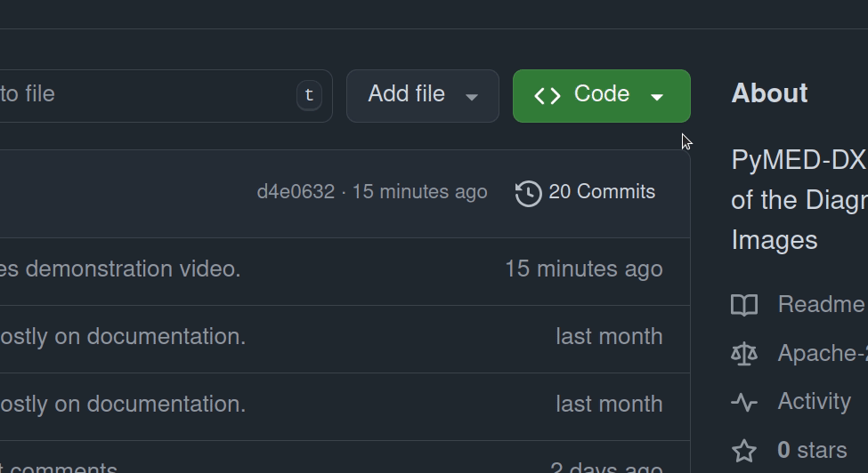

[](/LICENSE)

# PyMED-DX: A Python Tool for Diagnostic Value Evaluation in 2D Medical Images

**PyMED-DX** is a Python-based tool designed to streamline subjective evaluation studies in the medical field, focusing on 
the diagnostic value of 2D medical images. With minimal technical skills required, researchers can generate customizable 
questionnaires, collect and analyze observer responses. PyMED-DX is cross-platform and released under the 
Apache License 2.0.

Main features:
- **Predefined Questionnaire Templates**: Creates two types of questionnaires that can be customized with user-specific 
data. Two questionnaire types are supported:
  - _QType 1:_ The primary questionnaire type focuses on assessing the diagnostic value of 2D medical images.
  - _QType 2:_ Additional type supports subjective evaluation of machine learning models used in clinical settings 
  to produce 2D image outputs.
- **Image and Response Analysis**: Collect, aggregate, and analyze responses, supporting diagnostic studies and repeatability evaluation.
- **Automated Metrics Calculation**: Calculate metrics and statistical analyses of observer agreement on response data.
- **Randomization**: Shuffle questions in a questionnaire to mitigate the memory effect in surveys.
- **Localization**: The tool supports localization by allowing users to fill in templates before generating 
questionnaires, enabling use in various languages and geographical regions. 
- **Cross-platform**: The tool can be run on Linux and Windows OS.


## Table of Contents
- [Installation](#installation)
- [Usage](#usage)
  - [Loading observer data](#loading-observer-data)
  - [Loading image data](#loading-image-data)
  - [Question generation](#question-generation)
  - [Questionnaire generation](#questionnaire-generation)
  - [Questionnaire export](#questionnaire-export)
  - [Response import](#response-import)
  - [Metric calculation](#metric-calculation)
  - [Statistical analysis](#statistical-analysis)
  - [Visualizations](#visualizations)
- [Examples](#examples)
- [License](#license)

[//]: # (- [Acknowledgments]&#40;#acknowledgments&#41;)

## Installation
The tool requires the following Python modules:
- sqlalchemy
- click
- regex
- plotly
- pandas
- sklearn
- krippendorff
- pingouin
- pillow
- pydicom

The repository also contains `reqirements.txt` for module installation. It is recommended to create pip or conda 
virtual environments and to install modules inside the environment. The following command shows how to create and 
activate the virtual environment.

```bash
python -m venv venv
source venv/bin/activate
pip install -r requirements.txt
```

## Usage
Below is an overview of the tool’s commands, including their purpose and usage examples with option details. Note that certain options are supported only for specific questionnaire types, such as QType1 or QType2; where applicable, this is clearly indicated in the documentation.

### Loading observer data
Load all observer data from the file path to the database.

```shell
python main.py load observers --filepath <filepath>
```
Options:
- `--filepath`, `-f` - Path to the file containing observer data. 

Example contents of the file with observer data:
```
[
    {"name": "John Dear", "token": "124456"},
    {"name": "Stephen Kain", "token": "124456"},
    {"name": "Doug Mason", "token": "124456"}
]
```


### Loading image data
Loads images with specific file extensions from a given directory into the database alongside their metadata if available. At the moment the tool has built-in support for 2D images only. 

Only paths to the image files are loaded so that images are loaded during operations that require image data. Once loaded to the database, the images **should not be moved to another location**. If moved, the paths in the Image database table should be updated.


```bash
python main.py load images --qtype <questionnaire-type> --directory </path/to/image/directory> --extension <file-extension-with-dot> --metadata-file <file-name>
```
Options:
- `--qtype`, `-q` - Type of questionnaire that will be using the images. Currently supported values are 1 and 2.
- `--directory`, `-d` - Path to the directory containing the images. The immediate parent directory will be considered as a dataset name.
- `--extension`, `-e` - A list of image extensions to be loaded from the directory. An extension is a string preceded by a dot sign (e.g. '.png').
- `--metadata-file`, `-m` - An image metadata filename. If not specified, the metadata file must be named after the innermost directory of the `directory` option. 

**Metadata example - Questionnaire type 1**

The metadata file is a JSON-formatted file containing a list of dictionaries, where each dictionary represents metadata 
for a specific image. Below is a detailed description of the structure of each dictionary.

```json
[
  {
      "image_name": "001",
      "diagnoses": [],
      "comment": "Image with no associated diagnoses.",
      "type": "t1"  
  },
  {
      "image_name": "002",
      "diagnoses": [
        {
          "token": "diagnosis_token",
          "name": "Human readable diagnosis name"
        }
      ],
      "comment": "",
      "type": "t1"  
  }
]

```


| Key                | Type | Description                                                                                                                                                                                                       |
|--------------------|------|-------------------------------------------------------------------------------------------------------------------------------------------------------------------------------------------------------------------|
| `image_name`       | str  | The name or identifier of the image. This value is used to match the metadata with the corresponding image in the system.                                                                                         |
| `comment`          | str  | An optional field that provides additional information or commentary related to the image.                                                                                                                        |
| `type`             | str  | The type of the image, which may indicate its origin or characteristics (e.g., "reference", "ml_model_output", etc.). This field can be used to categorize images based on their processing level or source.             |
| `diagnoses`         | dict | A list containing the diagnoses associated with the image. Each disease is represented as a dictionary with the fields `name` and `token`. If no disease is associated with the image, this will be an empty list. |
| `token (diagnoses)` | str  | A unique token or identifier for the disease.                                                                                                                                                                     |
| `name (diagnoses)`  | str  | The name or label of the diagnosis.                                                                                                                                                                                 |

**Additional information**

When loading the images for type *QType1* questionnaires, make sure that all loaded images have their data in the metadata file. The names of the images are irrelevant, it is only important that the same name is entered in the field `image_name` in a metadata file.

**Metadata example - Questionnaire type 2**
```json
[
  {
      "image_name": "001",
      "diagnoses": [],
      "comment": "",
      "group": "1",
      "type": "ml-model-output"
  }
  ,
  {
      "image_name": "002680",
      "diagnoses": [
        {
          "token": "diagnosis_token",
          "name": "Human readable diagnosis name"
        }
      ],
      "comment": "",
      "group": "2",
      "type": "ml-model-output"
  }
]
```


| Key                | Type | Description                                                                                                                                                                                                       |
|--------------------|------|-------------------------------------------------------------------------------------------------------------------------------------------------------------------------------------------------------------------|
| `group`            | str  | Empty for the reference images. All other output images that are the result of one input should have the same unique group.                                                                                       |


A reference image serves as the input to machine learning models. It is not ranked alongside model outputs but is instead displayed to assist observers in determining which of the compared images best matches the reference image.

**Additional information**

The metadata files for the second questionnaire type (*QType2*) has an additional field called `group`. Two sets of images need to be loaded *QType2* questionnaires. The first set should consist of reference images whose file names match the `image_name` field in the metadata file. Additionally, the `group` field in the metadata file should be empty for all input images. In the metadata file for the output images the field `image_name` needs to be the same as the name of the input image. The field `group` should be assigned a unique identifier. Only one entry in the metadata file is needed for all output images of one group. The image groups are later used to generate questionnaires for ML model subjective quality assessment based on image ranking, where ranking is implemented through pair-wise comparisons. 

> [!IMPORTANT]
> Output images of the same group should be named according to pattern `image_name-model-dataset`. Image filenames along with metadata are used to extract information on ML model that was used to produce the image, and a dataset the image belongs to.


### Question generation
Generate questions depending on the choosen questionnaire type. If generating type 2 questionnaire was chosen, you can specify how many times an image from an image group will be repeated. By introducing repeated questions, response redundancy needed for intra-observer studies is introduced as well.

```shell
python main.py generate questions --qtype <supported-questionnaire-type> --nrepeat <n>
```
Options:
- `--qtype`, `-q` - Type of questionnaire the questions are generated for. Currently supported values are 1 and 2.
- `--repeat`, `-r` - Only applies to type 2 questionnaires. This option is used to specify how many times will each image from the image group repeat when generating the questions.

### Questionnaire generation
Generate questionnaires of specified type from the database questions. See [Localization](docs/localization.md) section on how to localize generated questionnaires for different langugages.

```bash
python main.py generate questionnaire --qtype <questionnaire-type> --qsubtype <questionnaire-subtype> --kquestions <n-questions-per-questionnaire> --nquestionnaire <n-questionnaires>
```
Options:
- `--qtype`, `-q` - Questionnaire type. Currently supported values are 1 and 2.
- `--qsubtype`, `-s` - Questionnaire subtype. QType1 can be regular and control, but QType2 can only be regular. Currently  supported values are `regular` and `control`.
- `--nquestionnaire`, `-n` - Number of questionnaires to be generated. If not specified, questionnaires will be generated until all questions have been used up.
- `--kquestions`, `-` - Number of questions per questionnaire. Used only in QType1.

### Questionnaire export
Exports questionnaire data to the specified directory. Currently, the tool supports questionnaire export in JSON and HTML formats.

```bash
python main.py export --directory <directory/to/export/to> --format <format> --qtype <questionnaire-type> --qsubtype <questionnaire-subtype>
```
Options:
- `--directory`, `-d` - Path to directory where the data will be exported.
- `--format`, `-f` - Format of output data. Currently  supported values are `json` and `html`.
- `--qtype`, `-q` - Questionnaire type. Currently supported values are 1 and 2.
- `--qsubtype`, `-s` - Questionnaire subtype. Questionnaires of type 1 can be regular and control, but questionnaires of type 2 can only be regular. Currently  supported values are `regular` and `control`.

> [!IMPORTANT]
> After export, it is important not to regenerate questions or questionnaires and preserve database state, so that imported responses can be correctly attributed to the corresponding questions.


### Response import
Load questionnaire responses to the database.

Path to a directory that contains subdirectories. Each subdirectory should represent an individual observer and contain their completed questionnaire responses downloaded upon questionnaire completion. Each subdirectory should be named after id of an observer whose responses it contains.

```bash
python main.py load responses --directory <directory/where/questionnaire/responses/are> --qtype <questionnaire-type>
```
Options:
- `--directory`, `-d` - Path to the directory containing the responses. Responses of the same observer should be in a subdirectory named after observer id from a PyMED-DX database.
- `--qtype`, `-q` - Questionnaire type. Currently supported values are 1 and 2.


### Metric calculation
Calculate metric values based on responses in a database. Currently supported metrics are:
- Diagnostic Score (QType1 responses).
- Copeland Score (QType2 responses). 

The **diagnostic score** or **diagnostic value**, ranging from -5 to 5, is based on response correctness and confidence. If an image is deemed inadequate due to low quality, the score is set to 0.

**Copeland score** is calculated using the [Copeland ranking algorithm](https://en.wikipedia.org/wiki/Copeland%27s_method) for pairwise comparisons of ML model image outputs. At the end of the algorithn, each image from a compared group of images (determined by `image_group` in image metadata file) is assigned a Copeland score. Since the images are generated by ML models, the scores are attributed to the respective models. The final ranking of models is obtained by averaging the Copeland scores across all images produced by each model. 


Prior to metric calculation, it is necessary to import responses for appropriate questionnaire type.

```bash
python main.py analyze metrics --qtype <questionnaire-type> --mtype <metric-type>
```
Options:
- `--qtype`, `-q` - Questionnaire type. Currently supported values are 1 and 2.
- `--mtype`, `-t` - What metric to calculate. Choices: ['dv', 'cs'], 'dv' for diagnostic value, or diagnostic score, and 
'cs' for Copeland's score.


### Statistical analysis
Run inter- or intra-observer statistical tests on response data. 

Implemented inter-observer agreement measures are Cohen's $\kappa$ and Krippendorff's $\alpha$.
Implemented intra-observer agreement measures are Cronbach's $\alpha$, all Guttman lambda algorithms (except $\lambda_{4}$), and Interclass 
correlation (ICC).

For responses of the first survey type, tests are conducted on values of diagnostic score, and for the second type on response of which image in pair comparison is of better quality.
```bash
python main.py analyze stats --qtype <questionnaire-type> --stype <stats-analysis-type> --oid <observer-id1> [--oid <observer-id2>]
```
Options:
- `--qtype`, `-q` - Questionnaire type. Currently supported values are 1 and 2.
- `--stype`, `-s` - Statistic analysis type. Valid values are `['inter', 'intra']` for inter- and intra-observer
- `--oid`, `-o` - Identifier of the observer whose responses will be used for statistical analysis. This option is 
currently supported just for the `--stype intra` option.

More detail on statistical analysis can be seen in [Observer agreement measurements](docs/statistics.md) section.

### Visualizations
Draws boxplot or histogram for metrics and saves them to the disk.

```shell
python main.py analyze visual --qtype <questionnaire-type> --vtype <visual-type> --directory <directory/to/save/the/plot>
```
Options:
- `--qtype`, `-q` - Questionnaire type. Currently supported values are 1 and 2.
- `--vtype`, `-v` - Visualization type. Currently supported `boxplot` and `histogram`.
- `--directory`, `-d` - Where to save the plots.

For `QType1`, boxplot and histograms are ploted for diagnostic value grouped by (1) observers, and (2) datasets. For `QType2` plots are produced for ratings grouped by ML models.

## Examples

The `scripts` directory contains scripts to run end-to-end examples for both questionnaire types. It also contains both the generator and analyzer components of the pipeline, separately, again for both questionnaire types. Note that the example scripts are designed for Linux systems only and aim to demonstrate the complete usage pipeline of the tool.

### End-to-end examples

There are two ways to run the end-to-end examples that are provided. GIT Codespaces and native Linux.

#### GIT Codespaces

The preferred way to run the examples is to use GIT Codespaces and let GIT prepare and install the whole environment for you. To run a new codespace click on the arrow on the green `Code` button, select a `Codespaces` tab, and create a Codespace as displayed in the following image.



After the Codespace is ready (this might take a minute or two), you can run one of the two scripts provided like this:

```bash
./scripts/end-to-end-example1.sh
```

or

```bash
./scripts/end-to-end-example2.sh
```

> [!IMPORTANT]
> **Note for QType 1 questionnaires.** 
> If you want to download questionnaires from the Codespace to your local machine, make sure to also download the images directory and place it in the same location as the questionnaires locally. Otherwise, the images in the questionnaires will not be displayed.

#### Running on your local Linux machine

In order to run the examples directly on your Linux machine, we suggest running these commands in the terminal, but first make sure you position yourself in the desired directory:

```bash
git clone https://github.com/goranagojic/PyMED-DX
cd PyMED-DX
python -m venv venv
source venv/bin/activate
pip install -r requirements.txt 
```

After these commands you can run the following commands to run the end-to-end pipelines:

```bash
./scripts/end-to-end-example1.sh
```

or

```bash
./scripts/end-to-end-example2.sh
```


### Example data explanation
The scripts use input images from `examples/qtype1/images` for *QType1* and `examples/qtype2/images` for *QType2.* The images for *QType* one are part of publicly available [DRIVE](https://ieeexplore.ieee.org/document/1282003) fundus image dataset. The reference images used in *QType* are also from DRIVE dataset, and the machine learning outputs are generated from DRIVE images using publicly available deep neural networks.

Here is an outline of `examples` directory.
```
examples/
├── qtype1/               
│   ├── images/           -- input images
│   ├── questionnaires/   -- questionnaires are exported here
│   ├── responses/        -- questionnaire responses are here
│   ├── plots/            -- visualizations are stored here
|   └── survey.db         -- a database file containing questionnaires
└── qtype2/
    ├── images/
    ├── questionnaires/
    │   └── note.txt      -- questionnaires to big for git, see download link
    ├── responses/
    ├── plots/
    └── note.txt          -- database file for qtype2 is big, see download link
```

## License
This project is licensed under the Apache License 2.0 - see the [LICENSE](./LICENSE) file for details.

<!-- ## Acknowledgments
TODO -->
