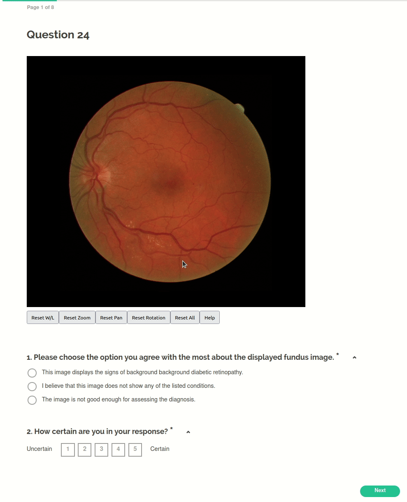
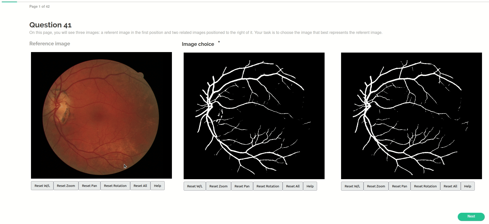

# Questionnaires in PyMED-DX

PyMED-DX generates two types of questionnaires designed to assess the diagnostic value of medical images through subjective evaluation studies. These questionnaires provide a structured approach for collecting responses from survey participants and analyzing the gathered data efficiently.

## Types of Questionnaires

### QT1 - Diagnosis Selection Questionnaire

- This questionnaire presents participants with a medical image and asks them to select the correct diagnosis from multiple options.
- A Likert scale is included for participants to indicate their confidence in the selected answer.
- A Likert scale is included for participants to indicate their confidence in the selected answer.

**Figure 1: An example of QT1**

### QT2 - Image Ranking Questionnaire

- Designed for comparative evaluation of multiple images produced by different algorithms.
- Participants rank the images based on a given criterion (e.g., clarity, diagnostic usefulness).
- Responses help assess the relative performance of various image processing methods.

**Figure 2: An example of QT2**

## Medical Image Manipultation Tools

Questionnaires generated by PyMED-DX include questions related to the medical images displayed within them. To 
facilitate precise answering, users can manipulate the images to enhance specific regions or properties relevant to the 
questions. The supported image manipulation tools are:
- Window/Level (Brightness/Contrast) Tool
- Zoom Tool
- Pan Tool
- Rotation Tool

Refer to the following subsections for demonstrations on how to use these tools.

### Window/Level Tool

**How to activate:** Hold right mouse click on the image and drag.

**Figure 3: Window/level tool demonstration.**

### Zoom Tool
**How to activate:** Hover over the image and scroll the mouse middle button.

**Figure 4: Zoom tool demonstration.**

### Pan Tool
**How to activate:** Hold left mouse button on the image and drag.

**Figure 5: Pan tool demonstration.**

### Rotation Tool
**How to activate:** Hold the middle mouse button and drag.

**Figure 6: Rotation tool demonstration.**